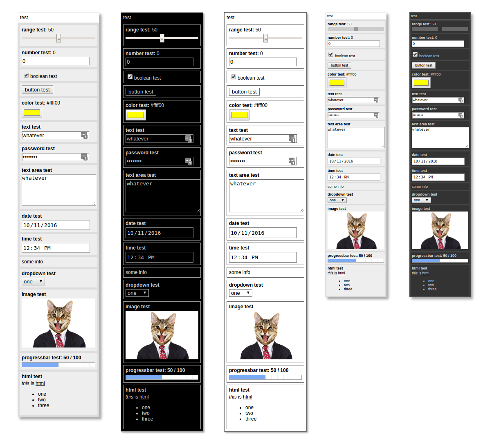

# quicksettings
QuickSettings is a JavaScript library for making a quick settings panel to control code parameters.

## Setup

You can use the files from this repo to your project or directly link to the main minified js file at:

https://cdn.jsdelivr.net/quicksettings/1.6/quicksettings.min.js

QuickSettings is fully require.js compatible. So add the script to your HTML or use require to import it.

You’ll also need to load a style sheet. There are two ways to do this. The simple way is to call:

    QuickSettings.loadStyleSheet();

With no parameter, this loads the default style sheet. You can also load a specific style by passing in one of the strings:

    "black", "white", "minimal" or "minimal_dark"
    
Here you can see examples of all five styles:

Alternately, you can add a stylesheet to the page itself, linking to one of the following:

https://cdn.jsdelivr.net/quicksettings/1.6/quicksettings.css

https://cdn.jsdelivr.net/quicksettings/1.6/quicksettings_black.css

https://cdn.jsdelivr.net/quicksettings/1.6/quicksettings_white.css

https://cdn.jsdelivr.net/quicksettings/1.6/quicksettings_minimal.css

https://cdn.jsdelivr.net/quicksettings/1.6/quicksettings_minimal_dark.css

Or you can alter any of this CSS to create your own custom stylesheet and add it to the page.

## Creating a Panel

HTML UI controls are created within a QuickSettings panel on your page. Create the panel with:

    var settings = QuickSettings.create(x, y, panelTitle);
    
Destroying a panel removes it from the page and nulls out all methods and properties.

    settings.destroy();

## Adding Controls

Now you can add controls to the panel. Supported controls are:

    settings.addRange(title, min, max, value, step, callback);  // creates a range slider
    settings.addNumber(title, min, max, value, step, callback); // creates a number input
    settings.addColor(title, color, callback);                  // creates a color input
    settings.addBoolean(title, value, callback);                // creates a checkbox
    settings.addText(title, text, callback);                    // creates an input text field
    settings.addTextArea(title, text, callback);                // creates a resizable text area
    settings.addButton(title, callback);                        // creates a button
    settings.addInfo(title, text);                              // creates informational text
    settings.addDropDown(title, [items], callback);             // creates a dropdown list
    settings.addImage(title, imageURL);                         // creates and image element with the specified URL
    settings.addProgressBar(title, max, value, showNumbers);    // creates a progress bar
    settings.addElement(title, htmlELement);                    // adds any arbitrary HTML element to the panel
    settings.addHTML(title, htmlString);                        // adds any arbitrary HTML to the panel
    settings.addPassword(title, text, callback);                // adds a password text field
    settings.addDate(title, date, callback);                    // adds a date input
    settings.addTime(title, time, callback);                    // adds a time input
    
See Master Demo for all of these examples: http://htmlpreview.github.io/?https://github.com/bit101/quicksettings/blob/master/demos/master_demo.html
    
For most controls, the callback will pass the current value of the control. For the button, it passes a reference to the button itself. For the dropdown it passes and object that contains properties index and value (the selected index and the value of the selected item).

The date control implementation of the control will vary on platforms. On some platforms, this will be the same as a text input. Date input must be in the form aof a string: "YYYY-MM-DD". Output value will be the same.

The time control implementation of the control will vary on platforms. On some platforms, this will be the same as a text input. Time input must be in the form aof a string: "HH-MM" or "HH:MM:SS" in 24-hour format. Output value will be the same.

## Querying Controls

You can also query the value of controls at any time with:

    settings.getRangeValue(title);
    settings.getNumberValue(title);
    settings.getBoolean(title);
    settings.getColor(title);
    settings.getText(title);
    settings.getInfo(title);
    settings.getDropDownValue(title);
    settings.getProgressValue(title);
    
## Setting Values Programatically    

And set values of controls with:

    settings.setRangeValue(title, value);
    settings.setNumberValue(title, value);
    settings.setBoolean(title, value);
    settings.setColor(title, color);
    settings.setText(title, text);
    settings.setInfo(title, text);
    settings.setDropDownIndex(title, index);
    settings.setImageURL(title, imageURL);
    settings.setProgressValue(title, value);
    
If, for some reason, you need to change the min, max or step of a range input or number input, use:

    settings.setRangeParameters(title, min, max, step);
    settings.setNumberParameters(title, min, max, step);
    
Set the number of rows in a text area (defaults to 5) with:

    settings.setTextAreasRows(title, rows);
    
## Removing, Enabling, Disabling Controlsoc

You can remove any control with:

    settings.removeControl(title);
    
Or disable and reenable any controls that can be enabled/disabled with:

    settings.disableControl(title);
    settings.enableControl(title);

## Panel Settings

The panel is draggable and collapsible/expandable by a double click on the title bar by default. The following methods affect this behavior:

    settings.setDraggable(bool);
    settings.setCollapsible(bool);
    settings.collapse();
    settings.expand();
    settings.toggleCollapsed():

You can show and hide the panel with the following:

    settings.show();
    settings.hide();
    settings.toggleVisibility();
  
Or, you can set a keyboard key that will show and hide the panel when pressed:

    settings.setKey(char);
  
You can set the position of the panel with:

    settings.setPosition(x, y);
    
If the panel is draggable, you can have it snap to a grid when dropped. And you can specify the size of that grid:

    settings.setSnapToGrid(bool);
    settings.setGridSize(number);

By default, the panel will be 200px wide and grow in height to fit its content. You can set an explicit size with:

    settings.setSize(w, h);

Or, perhaps more useful, you can set only the width and let the height continue to grow as normal:

    settings.setWidth(w);
    
You can also, of course, set the width in the CSS if you want. But this allows for dynamic width setting, or having multiple panels with different widths. If you want to size the panel to exactly fit some certain content, add 20px to the content size. For example, if you've added an element using `addElement` and that element is 300px wide, say `setWidth(320)` and it should fit just fine.

## Styles

Styles are in quicksettings.css which must be included. Alternate styling can be done through this. I've included a minimal style sheet which makes everything a bit more compact and does some advanced styling on the sliders to make them look more the same across browsers.

## Responding to changes

In addition to adding a callback on each control, you can add a global change handler:

    settings.setGlobalChangeHandler(callback);
    
This callback will be called whenever any change is made to any control in this panel.

There are also bind functions:

    settings.bindRange(title, min, max, value, step, object);
    settings.bindColor(title, color, object);
    settings.bindBoolean(title, value, object);
    settings.bindText(title, text, object);
    settings.bindDropDown(title, [items], object);
    settings.bindPassword(title, text, object);
    settings.bindDate(title, date, object);
    settings.bindTime(title, time, object);
    settings.bindNumber(title, value, object);
    
These function the same as their "add" counterparts, but instead of a callback, you pass in an object. When the control's value is changed, it will assign the new value to the property of that object that matches the title. For example:

    settings.bindBoolean("visible", true, model);
    
When the checkbox is clicked, it will set `model.visible` to true or false.

These two changes allow you to have a single model object and a single change handler, which can greatly simplify your code. See binddemo.js/html in the demo folder. Note that there are no bind functions for info and button, as these do not have changing values. The global change handler will be called when a button is pressed though.

## Misc.

Pretty much all methods that are not getters will return a reference to the panel itself, allowing you to chang calls.

    var panel = QuickSettings.create(10, 10, "Panel")
        .addRange("x", 0, 100, 50, 1)
        .addRange("y", 0, 100, 50, 1)
        .addRange("w", 0, 100, 50, 1)
        .addRange("h", 0, 100, 50, 1)
        .setGlobalChangeHandler(myChangeHandler);
        
## JSON Parser

You can also create your panel with a JavaScript object or JSON string. Just call:

    var panel = QuickSettings.parse(json, scope);
    
The `json` parameter is a JSON string or JavaScript object and `scope` is the object on which callbacks will be looked for, as callbacks will need to be specified as strings. JSON format:

    {
      "title": "Panel name",    // required string
      "x": 400,                 // required number
      "y": 30,                  // required number
      "draggable": true,        // optional bool
      "collapsible": true,      // optional bool
      "snapToGrid": true,       // optional bool
      "gridSize": 40,           // optional number
      "controls": []            // optional array of control objects
    }
    
Control object format:

    {
        "type": "range",        // required string
        "title": "my range",    // required string
        "value": 100,           // optional value:
                                    // number or string for most controls.
                                    // bool for boolean
                                    // array for dropdown
                                    // not used for button
        "min": 0,               // optional number (range and number only)
        "max": 100,             // optional number (range, number, progressbar only)
        "step": 1,              // optional number (range and number only)
        "callback": "onRange"   // optional string - maps to function name on scope object
    }

All controls are supported except `addElement`.

See Parse Demos below.

## Demos

- http://htmlpreview.github.io/?https://github.com/bit101/quicksettings/blob/master/demos/master_demo.html
- http://htmlpreview.github.io/?https://github.com/bit101/quicksettings/blob/master/demos/demo.html
- http://htmlpreview.github.io/?https://github.com/bit101/quicksettings/blob/master/demos/demo_minimal.html
- http://htmlpreview.github.io/?https://github.com/bit101/quicksettings/blob/master/demos/binddemo.html
- http://htmlpreview.github.io/?https://github.com/bit101/quicksettings/blob/master/demos/htmldemo.html
- http://htmlpreview.github.io/?https://github.com/bit101/weave/blob/master/demos/demo.html

Parse demos:

- http://htmlpreview.github.io/?https://github.com/bit101/quicksettings/blob/master/demos/parse_demo_1.html
- http://htmlpreview.github.io/?https://github.com/bit101/quicksettings/blob/master/demos/parse_demo_2.html
