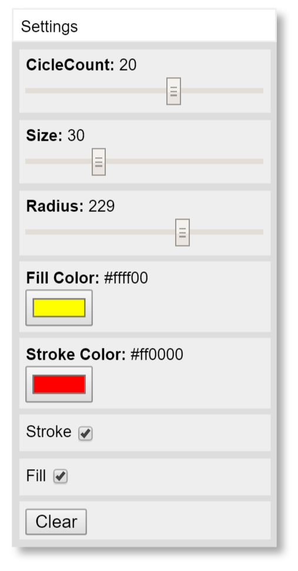

# quicksettings
QuickSettings is a JavaScript library for making a quick settings panel to control code parameters.

## Setup

You can use the files from this repo to your project or directly link to the main minified js file at:

https://cdn.jsdelivr.net/quicksettings/2.0/quicksettings.min.js

QuickSettings is fully require.js compatible. So add the script to your HTML or use require to import it.

When you create your first panel, QuickSettings will automatically inject its own default style sheet into the page. If you want to use a different style, call `QuickSettings.useExtStyleSheet()` prior to creating a panel. This will prevent the automatic css injection. You can then use one of the style sheets included in this repo or alter them to create your own styles.

## Creating a Panel

HTML UI controls are created within a QuickSettings panel on your page. Create the panel with:

    var settings = QuickSettings.create(x, y, panelTitle, parent);
    
The `x` and `y` parameters control the initial position of the panel and default to 0, 0.

The `panelTitle` parameter lets you add an optional title. It defaults to the string, "QuickSettings".

The `parent` parameter lets you specify where on the DOM you want to add the panel and will default to the document's body element.
    
Destroying a panel removes it from the page and nulls out all methods and properties.

    settings.destroy();

## Adding Controls

Now you can add controls to the panel. Supported controls are:

    settings.addBoolean(title, value, callback);                // creates a checkbox
    settings.addButton(title, callback);                        // creates a button
    settings.addColor(title, color, callback);                  // creates a color input
    settings.addDate(title, date, callback);                    // adds a date input
    settings.addDropDown(title, [items], callback);             // creates a dropdown list
    settings.addElement(title, htmlELement);                    // adds any arbitrary HTML element to the panel
    settings.addHTML(title, htmlString);                        // adds any arbitrary HTML to the panel
    settings.addInfo(title, text);                              // creates informational text
    settings.addImage(title, imageURL);                         // creates and image element with the specified URL
    settings.addNumber(title, min, max, value, step, callback); // creates a number input
    settings.addPassword(title, text, callback);                // adds a password text field
    settings.addProgressBar(title, max, value, showNumbers);    // creates a progress bar
    settings.addRange(title, min, max, value, step, callback);  // creates a range slider
    settings.addText(title, text, callback);                    // creates an input text field
    settings.addTextArea(title, text, callback);                // creates a resizable text area
    settings.addTime(title, time, callback);                    // adds a time input
    
See Master Demo for all of these examples: http://htmlpreview.github.io/?https://github.com/bit101/quicksettings/blob/master/demos/master_demo.html
    
For most controls, the callback will get passed the current value of the control. For the button, it passes a reference to the button itself. For the dropdown it passes and object that contains properties index and value (the selected index and the value of the selected item).

The color control implementation will vary on platforms. On some platforms, this will be the same as a text input. Color input is any valid color string such as "#f00", "#ff0000", "red", "rgb(255, 0, 0)", "rgba(255, 0, 0, 1)".

The date control implementation will vary on platforms. On some platforms, this will be the same as a text input. Date input must be in the form aof a string: "YYYY-MM-DD". Output value will be the same.

The time control implementation will vary on platforms. On some platforms, this will be the same as a text input. Time input must be in the form aof a string: "HH-MM" or "HH:MM:SS" in 24-hour format. Output value will be the same.

## Querying Controls

You can also query the value of controls at any time with:

    settings.getBoolean(title);
    settings.getColor(title);
    settings.getDate(title);
    settings.getDropDownValue(title);
    settings.getInfo(title);
    settings.getNumberValue(title);
    settings.getProgressValue(title);
    settings.getRangeValue(title);
    settings.getText(title);        // text, textarea, password
    settings.getTime(title);
    
## Setting Values Programatically    

And set values of controls with:

    settings.setBoolean(title, value);
    settings.setColor(title, color);
    settings.setDate(title, date);
    settings.setDropDownIndex(title, index);
    settings.setImageURL(title, imageURL);
    settings.setInfo(title, text);
    settings.setNumberValue(title, value);
    settings.setProgressValue(title, value);
    settings.setRangeValue(title, value);
    settings.setText(title, text);  // text, textarea, password
    settings.setTime(title, time);
    
If, for some reason, you need to change the min, max or step of a range input or number input, use:

    settings.setRangeParameters(title, min, max, step);
    settings.setNumberParameters(title, min, max, step);
    
Set the number of rows in a text area (defaults to 5) with:

    settings.setTextAreasRows(title, rows);
    
## Removing, Enabling, Disabling Controls

You can remove any control with:

    settings.removeControl(title);
    
Or disable and reenable any controls that can be enabled/disabled with:

    settings.disableControl(title);
    settings.enableControl(title);

## Panel Settings

The panel is draggable and collapsible/expandable by a double click on the title bar by default. The following methods affect this behavior:

    settings.setDraggable(bool);
    settings.setCollapsible(bool);
    settings.collapse();
    settings.expand();
    settings.toggleCollapsed():

You can show and hide the panel with the following:

    settings.show();
    settings.hide();
    settings.toggleVisibility();
  
Or, you can set a keyboard key that will show and hide the panel when pressed:

    settings.setKey(char);
  
You can set the position of the panel with:

    settings.setPosition(x, y);
    
If the panel is draggable, you can have it snap to a grid when dropped. And you can specify the size of that grid:

    settings.setSnapToGrid(bool);
    settings.setGridSize(number);

By default, the panel will be 200px wide and grow in height to fit its content. You can set an explicit size with:

    settings.setSize(w, h);

Or, perhaps more useful, you can set only the width and let the height continue to grow as normal:

    settings.setWidth(w);

You can also set a fixed height. If the controls do not fit in this height, they will scroll.

    settings.setHeight(h);
    

## Responding to changes

In addition to adding a callback on each control, you can add a global change handler:

    settings.setGlobalChangeHandler(callback);
    
This callback will be called whenever any change is made to any control in this panel.

There are also bind functions:

    settings.bindBoolean(title, value, object);
    settings.bindColor(title, color, object);
    settings.bindDate(title, date, object);
    settings.bindDropDown(title, [items], object);
    settings.bindNumber(title, value, object);
    settings.bindPassword(title, text, object);
    settings.bindRange(title, min, max, value, step, object);
    settings.bindText(title, text, object);
    settings.bindTextArea(title, text, object);
    settings.bindTime(title, time, object);    
    
These function the same as their "add" counterparts, but instead of a callback, you pass in an object. When the control's value is changed, it will assign the new value to the property of that object that matches the title. For example:

    settings.bindBoolean("visible", true, model);
    
When the checkbox is clicked, it will set `model.visible` to true or false.

These two changes allow you to have a single model object and a single change handler, which can greatly simplify your code. See binddemo.js/html in the demo folder. Note that there are no bind functions for info and button, as these do not have changing values. The global change handler will be called when a button is pressed though.

## Misc.

Pretty much every method that is not a getter will return a reference to the panel itself, allowing you to chain calls.

    var panel = QuickSettings.create(10, 10, "Panel")
        .addRange("x", 0, 100, 50, 1)
        .addRange("y", 0, 100, 50, 1)
        .addRange("w", 0, 100, 50, 1)
        .addRange("h", 0, 100, 50, 1)
        .setGlobalChangeHandler(myChangeHandler);
        
## JSON Parser

You can also create your panel with a JavaScript object or JSON string. Just call:

    var panel = QuickSettings.parse(json, parent, scope);
    
The `json` parameter is a JSON string or JavaScript object.

The `parent` is the parent element where the panel will be created, defaulting to `document.body`.

And `scope` is the object on which callbacks will be looked for, as callbacks will need to be specified as strings. If you're not adding callbacks in the JSON, you don't need this.

JSON format:

    {
      "title": "Panel name",    // optional string, default "QuickSettings"
      "x": 400,                 // optional number, default 0
      "y": 30,                  // optional number, default 0
      "draggable": true,        // optional bool,   default true
      "collapsible": true,      // optional bool,   default true
      "snapToGrid": true,       // optional bool,   default false
      "gridSize": 40,           // optional number  default 0
      "controls": []            // optional array of control objects
    }
    
Control object format:

    {
        "type": "range",        // required string
        "title": "my range",    // required string
        "value": 100,           // optional value:
                                    // number or string for most controls.
                                    // bool for boolean
                                    // array of option labels for dropdown
                                    // not used for button
        "min": 0,               // optional number (range and number only)
        "max": 100,             // optional number (range, number, progressbar only)
        "step": 1,              // optional number (range and number only)
        "callback": "onRange"   // optional string - maps to function name on scope object
    }

All controls are supported except `addElement`.

See Parse Demos below.

## Demos

- http://htmlpreview.github.io/?https://github.com/bit101/quicksettings/blob/master/demos/master_demo.html
- http://htmlpreview.github.io/?https://github.com/bit101/quicksettings/blob/master/demos/demo.html
- http://htmlpreview.github.io/?https://github.com/bit101/quicksettings/blob/master/demos/binddemo.html
- http://htmlpreview.github.io/?https://github.com/bit101/quicksettings/blob/master/demos/htmldemo.html
- http://htmlpreview.github.io/?https://github.com/bit101/weave/blob/master/demos/demo.html
- http://htmlpreview.github.io/?https://github.com/bit101/quicksettings/blob/master/demos/style_demo.html

Parse demos:

- http://htmlpreview.github.io/?https://github.com/bit101/quicksettings/blob/master/demos/parse_demo_1.html
- http://htmlpreview.github.io/?https://github.com/bit101/quicksettings/blob/master/demos/parse_demo_2.html
