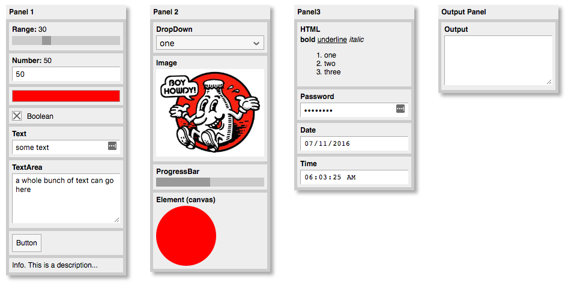

# quicksettings
QuickSettings is a JavaScript library for making a quick settings panel to control code parameters.




## Version 3 changes:

Version 3 is mostly about simplifying the panel, removing little used features and making getting and setting values easier.

- New features / changes:
    - All controls with settable values are now set with `panel.setValue(title, value)`
    - All controls with gettable values are now read with `panel.getValue(title)`
    - You can programatically get and set control values with JSON using `panel.getValuesAsJSON` and `panel.setValuesWithJSON`.
    - Calling `saveInLocalStorage(name)` will cause all changes in the panel to be continuously synced to local storage and restored when the panel is restarted. See details below, and demo project.

- Removed:
    - `panel.addInfo` and related methods are gone. These were just aliased to `panel.addHTML` anyway, so use that instead.
    - The functionality to parse an entire panel layout from JSON has been removed. This might be added in later as a separate module.
    - The snap-to-grid functionality has been removed.
    
Naturally, many of these changes will break backwards compatibility with version 2 or earlier. But the changes overall result in a cleaner, simpler API and are easy enough to migrate over to.

## Documentation and Demos

See http://bit101.github.com/quicksettings

## Setup

You can use the files from this repo in your project or directly link to the main minified js file at:

- https://cdn.jsdelivr.net/quicksettings/latest/quicksettings.min.js

If you want to use a specific version, use the actual version number, such as "2.0" in place of "latest" in the url.

QuickSettings is fully require.js compatible. So add the script to your HTML or use require to import it.

When you create your first panel, QuickSettings will automatically inject its own default style sheet into the page. If you want to use a different style, call `QuickSettings.useExtStyleSheet()` prior to creating a panel. This will prevent the automatic css injection. You can then use one of the style sheets included in this repo or alter them to create your own styles.

See the Styles Demo for examples of all the styles:  http://bit101.github.io/quicksettings/demos/styles_demo.html (source: http://bit101.github.io/quicksettings/demos/styles.js)

## Creating a Panel

HTML UI controls are created within a QuickSettings panel on your page. Create the panel with:

``` js
var settings = QuickSettings.create(x, y, panelTitle, parent);
```
    
The `x` and `y` parameters control the initial position of the panel and default to 0, 0.

The `panelTitle` parameter lets you add an optional title. It defaults to the string, "QuickSettings".

The `parent` parameter lets you specify where on the DOM you want to add the panel and will default to the document's body element.
    
Destroying a panel removes it from the page and nulls out all methods and properties.

``` js
settings.destroy();
```

## Adding Controls

Now you can add controls to the panel. Supported controls are:

``` js
settings.addBoolean(title, value, callback);                // creates a checkbox
settings.addButton(title, callback);                        // creates a button
settings.addColor(title, color, callback);                  // creates a color input
settings.addDate(title, date, callback);                    // adds a date input
settings.addDropDown(title, [items], callback);             // creates a dropdown list
settings.addElement(title, htmlELement);                    // adds any arbitrary HTML element to the panel
settings.addFileChooser(title, labelStr, filter, callback); // adds a file chooser
settings.addHTML(title, htmlString);                        // adds any arbitrary HTML to the panel
settings.addImage(title, imageURL, callback);               // creates and image element with the specified URL
settings.addNumber(title, min, max, value, step, callback); // creates a number input
settings.addPassword(title, text, callback);                // adds a password text field
settings.addProgressBar(title, max, value, valueDisplay);   // creates a progress bar
settings.addRange(title, min, max, value, step, callback);  // creates a range slider
settings.addText(title, text, callback);                    // creates an input text field
settings.addTextArea(title, text, callback);                // creates a resizable text area
settings.addTime(title, time, callback);                    // adds a time input
  ```
    
See Master Demo for all of these examples: http://bit101.github.io/quicksettings/demos/master_demo.html (source:  http://bit101.github.io/quicksettings/demos/masterdemo.js)
    
For most controls, the callback will get passed the current value of the control. For the button, it passes a reference to the button itself. For the dropdown, it passes an object that contains properties index, label and value (the selected index and the label and value of the selected item). For the file chooser, it gets passed a File object represending the file that was chosen. The `addImage` callback is called when the image finished loading.

The color control implementation will vary on platforms. On some platforms, this will be the same as a text input. Color input is any valid color string such as "#f00", "#ff0000", "red", "rgb(255, 0, 0)", "rgba(255, 0, 0, 1)".

The date control implementation will vary on platforms. On some platforms, this will be the same as a text input. Date input must be in the form aof a string: "YYYY-MM-DD". Output value will be the same.

The time control implementation will vary on platforms. On some platforms, this will be the same as a text input. Time input must be in the form aof a string: "HH-MM" or "HH:MM:SS" in 24-hour format. Output value will be the same.

## Querying Controls

You can also query the value of controls at any time with:

``` js
settings.getValue(title);
```

It's also possible to get an object containing all of the value for all user-interactive controls.

``` js
settings.getValuesAsJSON(asString);
```

This will give you an object containing the title and value of each object that can be changed by a user. Passing `true` for the `asString` parameter will give you a JSON-formatted string instead of an object.

For the file chooser, the Object version will include the actual File object representing the chosen file. The string version will stringify this to an empty object though: `"{}"`.

## Setting Values Programatically    

And set values of controls with:

``` js
settings.setValue(title, value);
```

If, for some reason, you need to change the min, max or step of a range input or number input, use:

``` js
settings.setRangeParameters(title, min, max, step);
settings.setNumberParameters(title, min, max, step);
```
    
Set the number of rows in a text area (defaults to 5) with:

``` js
settings.setTextAreasRows(title, rows);
```

You can also use the JSON you got by calling `getValuesAsJSON` in the method:

``` js
settings.setValuesFromJSON(json);
```

This will set all any controls named in the JSON with the values defined there. The Reset Demo has an example of using these methods to reset a panel to default values: http://bit101.github.io/quicksettings/demos/resetdemo.html (source: http://bit101.github.io/quicksettings/demos/resetdemo.js) 

## Persisting Controls with localStorage

Once you've set up your panel, you can call:

``` js
settings.saveInLocalStorage(name);
```

passing in a unique string to store the panel settings. Doing so causes a few things to happen. First, QuickSettings will immediatedly check to see if settings have been previously saved under this name. If so, they will be loaded and applied to the existing panel, overwriting any values that were just set in the code. After that, whenever any changes are made to any controls in the panel, the current state of the panel will be saved in localStorage. The ideal place to call this method is after you have added and set up all other controls in the panel.

See the Local Storage Demo to view this in action: http://bit101.github.io/quicksettings/demos/localstoragedemo.html (source: http://bit101.github.io/quicksettings/demos/localstoragedemo.js)
    
## Managing Controls

You can remove any control with:

``` js
settings.removeControl(title);
```
    
Or disable and reenable any controls that can be enabled/disabled with:

``` js
settings.disableControl(title);
settings.enableControl(title);
```
    
Or hide and show any control:

``` js
settings.hideControl(title);
settings.showControl(title);
```
    
Finally, you can override most existing style properties for controls with:

``` js
settings.overrideStyle(title, styleName, value);
```

For example, to change the font size in an intput text field named "text":

``` js
settings.overrideStyle("text", "fontSize", "20px");
```
    
Most controls, except for the boolean (checkbox) and button controls show a title label above the actual control. You can turn this on and off for any specific control:

``` js
settings.hideTitle(title);
settings.showTitle(title);
```
    
Or for all of the controls at once:

``` js
settings.hideAllTitles();
settings.showAllTitles();
```

## Panel Settings

The panel is draggable and collapsible/expandable by a double click on the title bar by default. The following methods affect this behavior:

``` js
settings.setDraggable(bool);
settings.setCollapsible(bool);
settings.collapse();
settings.expand();
settings.toggleCollapsed():
```

You can show and hide the panel with the following:

``` js
settings.show();
settings.hide();
settings.toggleVisibility();
```
  
Or, you can set a keyboard key that will show and hide the panel when pressed:

``` js
settings.setKey(char);
```
  
You can set the position of the panel with:

``` js
settings.setPosition(x, y);
```
    
By default, the panel will be 200px wide and grow in height to fit its content. You can set an explicit size with:

``` js
settings.setSize(w, h);
```

Or, perhaps more useful, you can set only the width and let the height continue to grow as normal:

``` js
settings.setWidth(w);
```

You can also set a fixed height. If the controls do not fit in this height, they will scroll.

``` js
settings.setHeight(h);
```

## Responding to changes

In addition to adding a callback on each control, you can add a global change handler:

``` js
settings.setGlobalChangeHandler(callback);
```
    
This callback will be called whenever any change is made to any control in this panel.

There are also bind functions:

``` js
settings.bindBoolean(title, value, object);
settings.bindColor(title, color, object);
settings.bindDate(title, date, object);
settings.bindDropDown(title, [items], object);
settings.bindNumber(title, value, object);
settings.bindPassword(title, text, object);
settings.bindRange(title, min, max, value, step, object);
settings.bindText(title, text, object);
settings.bindTextArea(title, text, object);
settings.bindTime(title, time, object);
```
    
These function the same as their "add" counterparts, but instead of a callback, you pass in an object. When the control's value is changed, it will assign the new value to the property of that object that matches the title. For example:

``` js
settings.bindBoolean("visible", true, model);
```
    
When the checkbox is clicked, it will set `model.visible` to true or false.

These two changes allow you to have a single model object and a single change handler, which can greatly simplify your code. See the Bind Demo: http://bit101.github.io/quicksettings/demos/binddemo.html (source: http://bit101.github.io/quicksettings/demos/binddemo.js).  

Note that there are no bind functions for button, and several other controls that do not have changing values. The global change handler will be called when a button is pressed though.

## Misc.

Pretty much every method that is not a getter will return a reference to the panel itself, allowing you to chain calls.

``` js
var panel = QuickSettings.create(10, 10, "Panel")
    .addRange("x", 0, 100, 50, 1)
    .addRange("y", 0, 100, 50, 1)
    .addRange("w", 0, 100, 50, 1)
    .addRange("h", 0, 100, 50, 1)
    .setGlobalChangeHandler(myChangeHandler);
```
        
