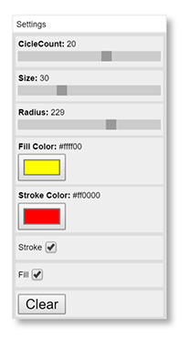

# quicksettings
QuickSettings is a JavaScript library for making a quick settings panel to control code parameters.

You can directly link to the main minified js file at:

https://cdn.jsdelivr.net/quicksettings/1.0/quicksettings.min.js

You’ll also need to add one of the QuickSettings style sheets: plain, minimal or minimal dark:

https://cdn.jsdelivr.net/quicksettings/1.0/quicksettings.css

https://cdn.jsdelivr.net/quicksettings/1.0/quicksettings_minimal.css

https://cdn.jsdelivr.net/quicksettings/1.0/quicksettings_minimal_dark.css

HTML UI controls are created within a QuickSettings panel on your page. Create the panel with:

    var settings = QuickSettings.create(x, y, panelTitle);

Now you can add controls to the panel. Supported controls are:

    settings.addRange(title, min, max, value, step, callback);  // creates a range slider
    settings.addColor(title, color, callback);                  // creates a color input
    settings.addBoolean(title, value, callback);                // creates a checkbox
    settings.addText(title, text, callback);                    // creates an input text field
    settings.addTextArea(title, text, callback);                // creates a resizable text area
    settings.addButton(title, callback);                        // creates a button
    settings.addInfo(title, text);                              // creates informational text
    settings.addDropDown(title, [items], callback);             // creates a dropdown list
    settings.addImage(title, imageURL);                         // creates and image element with the specified URL
    settings.addProgressBar(title, max, value, showNumbers);    // creates a progress bar
    settings.addElement(title, htmlELement);                    // adds any arbitrary HTML element to the panel
    settings.addHTML(title, htmlString);                        // adds any arbitrary HTML to the panel
    
For range, color, boolean and text, the callback will pass the current value of the control. For the button, it passes a reference to the button itself. For the dropdown it passes and object that contains properties index and value (the selected index and the value of the selected item).

You can also query the value of controls at any time with:

    settings.getRangeValue(title);
    settings.getBoolean(title);
    settings.getColor(title);
    settings.getText(title);
    settings.getInfo(title);
    settings.getDropDownValue(title);
    settings.getProgressValue(title);
    
And set values of controls with:

    settings.setRangeValue(title, value);
    settings.setBoolean(title, value);
    settings.setColor(title, color);
    settings.setText(title, text);
    settings.setInfo(title, text);
    settings.setDropDownIndex(title, index);
    settings.setImageURL(title, imageURL);
    settings.setProgressValue(title, value);
    
If, for some reason, you need to change the min, max or step of a range input, use:

    settings.setRangeParameters(title, min, max, step);
    
Set the number of rows in a text area (defaults to 5) with:

    settings.setTextAreasRows(title, rows);
    
You can remove any control with:

    settings.removeControl(title);
    
Or disable and reenable any controls that can be enabled/disabled with:

    settings.disableControl(title);
    settings.enableControl(title);

The panel is draggable and collapsible/expandable by a double click on the title bar by default. The following methods affect this behavior:

    settings.setDraggable(bool);
    settings.setCollapsible(bool);
    settings.collapse();
    settings.expand();
    settings.toggleCollapsed():

You can show and hide the panel with the following:

    settings.show();
    settings.hide();
    settings.toggleVisibility();
  
Or, you can set a keyboard key that will show and hide the panel when pressed:

    settings.setKey(char);
  
You can set the position of the panel with:

    settings.setPosition(x, y);

By default, the panel will be 200px wide and grow in height to fit its content. You can set an explicit size with:

    settings.setSize(w, h);

Or, perhaps more useful, you can set only the width and let the height continue to grow as normal:

    settings.setWidth(w);
    
You can also, of course, set the width in the CSS if you want. But this allows for dynamic width setting, or having multiple panels with different widths. If you want to size the panel to exactly fit some certain content, add 20px to the content size. For example, if you've added an element using `addElement` and that element is 300px wide, say `setWidth(320)` and it should fit just fine.

Add the library in a script tag, or via require.js.

Styles are in quicksettings.css which must be included. Alternate styling can be done through this. I've included a minimal style sheet which makes everything a bit more compact and does some advanced styling on the sliders to make them look more the same across browsers.

## New as of October 28, 2015

Global change handler:

    settings.setGlobalChangeHandler(callback);
    
This callback will be called whenever any change is made to any control in this panel.

Bind functions:

    settings.bindRange(title, min, max, value, step, object);
    settings.bindColor(title, color, object);
    settings.bindBoolean(title, value, object);
    settings.bindText(title, text, object);
    settings.bindDropDown(title, [items], object);
    
These function the same as their "add" counterparts, but instead of a callback, you pass in an object. When the control's value is changed, it will assign the new value to the property of that object that matches the title. For example:

    settings.bindBoolean("visible", true, model);
    
When the checkbox is clicked, it will set `model.visible` to true or false.

These two changes allow you to have a single model object and a single change handler, which can greatly simplify your code. See binddemo.js/html in the demo folder. Note that there are no bind functions for info and button, as these do not have changing values. The global change handler will be called when a button is pressed though.

## Demos

- http://htmlpreview.github.io/?https://github.com/bit101/quicksettings/blob/master/demos/demo.html
- http://htmlpreview.github.io/?https://github.com/bit101/quicksettings/blob/master/demos/demo_minimal.html
- http://htmlpreview.github.io/?https://github.com/bit101/quicksettings/blob/master/demos/binddemo.html
- http://htmlpreview.github.io/?https://github.com/bit101/quicksettings/blob/master/demos/htmldemo.html
- http://htmlpreview.github.io/?https://github.com/bit101/weave/blob/master/demos/demo.html
